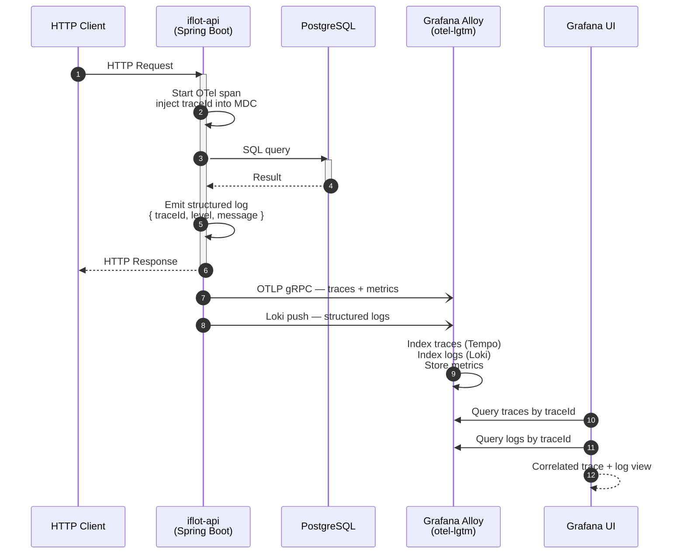
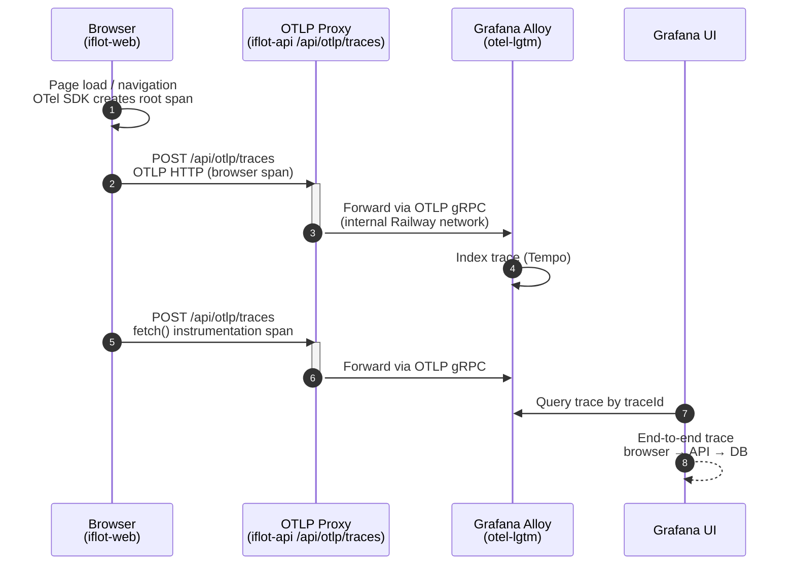

# ADR-005 — Observability Strategy

**Status:** Accepted
**Date:** April 2026
**Authors:** Architecture Lead

---

## Context

iFlot 2026 is a logistics platform where operational failures have direct business
consequences — a trip in the wrong state blocks billing, a guide with missing data
produces a zero-value prefactura, a stranded record requires manual intervention.
The legacy system had no observability. Failures were discovered by users, reported
by email, and corrected by vendor database access.

iFlot 2026 must be observable from day one. The observability strategy must serve
two goals simultaneously:

- **Operational visibility** — the team must be able to detect, diagnose, and
  resolve failures without database access or user reports.
- **Junior developer education** — observability is a production engineering
  discipline. Junior developers must see it working in a real deployed environment
  and understand why it exists.

The strategy must also fit the constraints of the POC phase: open source tooling,
minimal operational overhead, single Railway service slot for the full stack.

---

## Decision

### Observability standard

**OpenTelemetry** is the selected instrumentation standard for all signals —
traces, metrics, and logs — across both `iflot-api` and `iflot-web`.

OpenTelemetry is vendor-neutral. Instrumentation code does not change if the
backend changes. This decision protects the investment in instrumentation
regardless of future infrastructure decisions.

### Observability stack

**`grafana/otel-lgtm`** is the selected observability backend for the POC.

This is a single Docker image maintained by Grafana Labs that bundles:

| Component | Purpose |
|---|---|
| Grafana Alloy | OpenTelemetry collector — receives OTLP signals from all sources |
| Loki | Log aggregation and querying |
| Tempo | Distributed trace storage and querying |
| Grafana | Unified dashboard and visualization layer |

A single container covers the full observability pipeline. No Prometheus is
required — Alloy receives metrics via OTLP natively and Grafana queries them
directly. This eliminates Prometheus as an intermediate component.

`grafana/otel-lgtm` is not recommended for production at scale. It is explicitly
selected for POC use: it requires no configuration to start, persists data
in-process, and provides a complete working stack that junior developers can
explore immediately.

---

## Signal flow

### Backend observability

The following sequence shows how a single HTTP request to `iflot-api` produces
traces, metrics, and logs that are correlated and visible in Grafana.



Every log line carries the `traceId` of the originating request via MDC. This
means a single trace ID in Tempo links directly to all log entries produced
during that request — across controllers, services, and repositories.

### Frontend observability

The browser cannot send OTLP signals directly to Grafana Alloy without exposing
the collector endpoint to the public internet. Browser telemetry is routed
through an OTLP Proxy endpoint in `iflot-api`.



When the browser span carries the same `traceId` as the API span it triggered,
Tempo assembles a single end-to-end trace that spans browser navigation, the API
call, and the database query. This gives a complete picture of a user interaction
in one view.

---

## Signal sources

### Backend — `iflot-api`

Spring Boot 3 with Micrometer provides native OpenTelemetry support via the
OTLP exporter. No manual instrumentation is required for standard Spring
components — HTTP requests, database queries, and JVM metrics are captured
automatically.

**Dependencies:**

```xml
<dependency>
    <groupId>io.micrometer</groupId>
    <artifactId>micrometer-tracing-bridge-otel</artifactId>
</dependency>
<dependency>
    <groupId>io.opentelemetry.instrumentation</groupId>
    <artifactId>opentelemetry-spring-boot-starter</artifactId>
</dependency>
```

**Configuration:**

```yaml
management:
  otlp:
    metrics:
      export:
        url: http://otel-lgtm:4318/v1/metrics
  tracing:
    sampling:
      probability: 1.0   # 100% in development and POC; reduce in production
```

Structured logging uses `logstash-logback-encoder`. Every log line is emitted
as JSON with a `traceId` propagated via MDC, so logs and traces are correlated
by default.

### Frontend — `iflot-web`

The React SPA instruments page loads, navigation, and outbound fetch calls using
the OpenTelemetry JavaScript SDK.

**Key packages:**

```
@opentelemetry/sdk-web
@opentelemetry/instrumentation-fetch
@opentelemetry/instrumentation-document-load
```

Browser telemetry is routed through the OTLP Proxy in `iflot-api`. The collector
is never exposed publicly.

### Signal transport

| Source | Protocol | Endpoint |
|---|---|---|
| `iflot-api` → Alloy | OTLP gRPC | `otel-lgtm:4317` |
| `iflot-web` → OTLP Proxy | OTLP HTTP | `iflot-api/api/otlp/traces` |
| OTLP Proxy → Alloy | OTLP gRPC | `otel-lgtm:4317` |

---

## Deployment

The observability stack runs as a single Railway service using the
`grafana/otel-lgtm` public image. No custom build or configuration is required
to start. Grafana is accessible via the Railway-assigned public URL for that
service.

Locally, the same image runs as part of the `docker-compose.yml` alongside
`iflot-api`, `iflot-web`, and PostgreSQL.

### Data persistence

`grafana/otel-lgtm` stores data in-process. Data does not survive container
restarts. This is acceptable for POC use — the goal is operational visibility
during active development and demos, not long-term retention.

If persistence is required before a production-grade stack is adopted, a Railway
volume can be attached to the service. This decision is deferred.

---

## Rationale

**Why OpenTelemetry over vendor-specific SDKs?**
OpenTelemetry is the CNCF standard for observability instrumentation. It
decouples instrumentation from the backend. The same instrumentation code works
with Grafana, Datadog, Honeycomb, or any OTLP-compatible backend. Vendor-specific
SDKs create lock-in at the instrumentation layer — the most expensive layer to
change.

**Why `grafana/otel-lgtm` over a separate Prometheus + Loki + Tempo + Grafana stack?**
A full separated stack would require four Railway service slots — unavailable on
the Hobby plan without consuming the entire service budget. It would also require
configuration wiring between components that adds operational overhead without
architectural benefit at POC scale. `grafana/otel-lgtm` provides the same
signal coverage in one container with zero configuration.

**Why no Prometheus?**
Prometheus is a pull-based scraper. It requires a separate scrape configuration
and adds a component to the pipeline. Grafana Alloy receives metrics via OTLP
push natively, which is the model Spring Boot 3 and Micrometer use by default.
Prometheus would add complexity without providing capabilities not already
covered by the OTLP pipeline.

**Why route browser telemetry through `iflot-api` and not directly to Alloy?**
Exposing Grafana Alloy's OTLP endpoint publicly would require either opening a
Railway public URL for the collector or adding CORS configuration to a component
not designed for public exposure. Routing through an OTLP Proxy in `iflot-api`
keeps the collector on the internal Railway network, avoids public exposure of
infrastructure endpoints, and allows the API to add trace context enrichment
before forwarding.

**Why observability in Railway and not local-only?**
Junior developers must observe real traffic in a deployed environment. Local
observability on synthetic traffic does not produce the same learning value as
watching distributed traces from actual HTTP requests made by a stakeholder
during a demo. The cost of one Railway service slot is justified by this goal.

**Why two sequence diagrams and not one?**
The backend and frontend signal flows have different actors, different protocols,
and different failure modes. A single diagram combining both would be wide and
hard to read. Two focused diagrams are easier to use as reference during
implementation and code review.

---

## Consequences

- All signals — traces, metrics, logs — use OpenTelemetry. No vendor lock-in at
  the instrumentation layer.
- Distributed traces span browser → API → database. A single Tempo trace shows
  the complete lifecycle of a user interaction.
- Logs are structured JSON correlated with trace IDs. Searching logs by trace ID
  in Loki returns all entries for a single request across all components.
- The OTLP Proxy adds one component to `iflot-api` that is not business logic.
  It must be clearly documented and separated from domain code.
- Data does not persist across container restarts. This is a known and accepted
  limitation for the POC phase.
- Migrating to a production-grade stack (separate Loki, Tempo, Mimir, Grafana)
  requires only collector and backend configuration changes. Application
  instrumentation code does not change.
- `grafana/otel-lgtm` is not maintained for production SLAs. A migration
  decision must be made before any customer-facing production deployment.

---

## Alternatives considered

**Prometheus + Grafana (metrics only)**
Rejected. Covers only metrics. Does not provide distributed tracing or log
correlation. Incomplete observability for a system where state transition failures
are the primary failure mode.

**Datadog or New Relic (SaaS observability)**
Rejected. Introduces cost at POC scale and creates vendor dependency at the
instrumentation layer if vendor-specific SDKs are used. OpenTelemetry with a
self-hosted backend achieves the same result without either constraint.

**Elastic Stack (Elasticsearch + Kibana + APM)**
Rejected. High resource consumption. Operationally complex for a single-service
Railway deployment. Not appropriate for POC scale.

**Separate Loki + Tempo + Mimir + Grafana services**
Rejected for POC phase. Exceeds Railway Hobby plan service limits. Adds
configuration complexity without capability benefit at current scale. Remains
the recommended migration target for production deployment.

**Local observability only (no Railway deployment)**
Rejected. Does not meet the pedagogical goal of exposing junior developers to
observability in a real deployed environment. Local synthetic traffic does not
replicate the value of observing live requests during stakeholder demos.

**Single combined sequence diagram**
Rejected. Backend and frontend flows have different actors, protocols, and failure
modes. A single diagram would be too wide to read comfortably and harder to use
as implementation reference.