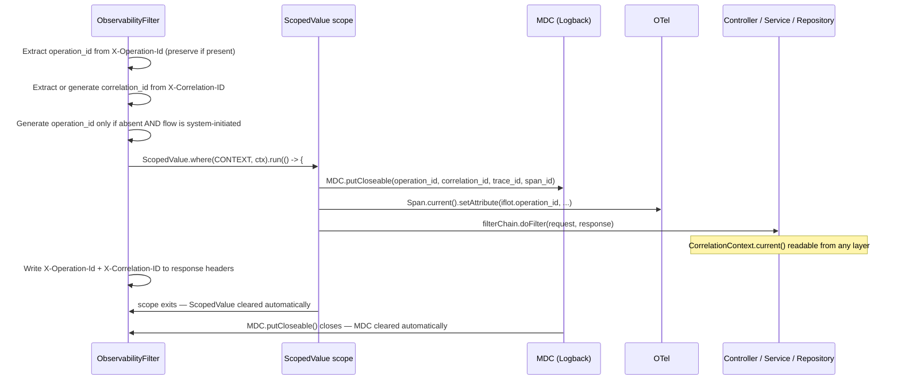
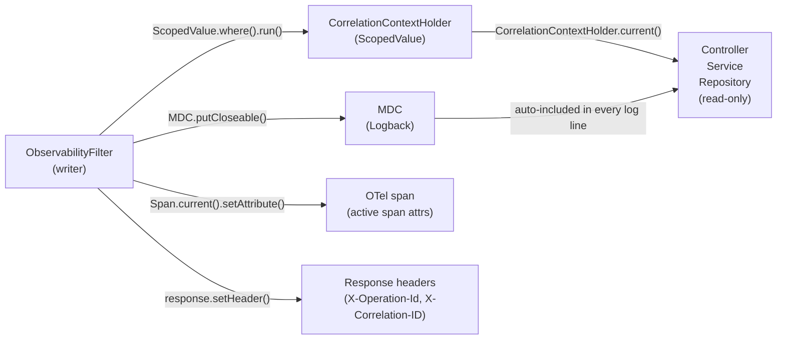

# ADR-007 — Context Backend Propagation for the Observability Layer

**Status:** Accepted
**Date:** 2026-04-19
**Deciders:** Backend lead, Architecture team
**Tags:** observability, virtual-threads, java-25, context-propagation

---

## Why this decision matters

iFlot API targets 1,700 QPS on its highest-load flow. Virtual threads are
enabled from day one. The mechanism used to carry correlation identifiers
across the request lifecycle determines thread safety, memory behavior, and
diagnostic accuracy under that load.

Getting this wrong means silently contaminated logs, missing correlation IDs
in production incidents, and a refactor under pressure.

---

## Context

The observability layer must propagate three correlation identifiers across
every request without threading them through method signatures:

| Identifier | Purpose | Owner |
|---|---|---|
| `operation_id` | Business flow correlation. Survives retries and async steps within the same logical operation. | Frontend generates for user-initiated flows. Backend generates only for system-initiated flows. |
| `correlation_id` | External/support correlation. Passed from API gateway or client tooling. Generated if absent. | HTTP header `X-Correlation-ID` |
| `trace_id` / `span_id` | Technical execution correlation. Links logs, traces, and spans. | OpenTelemetry only. Application code never generates or propagates these. |

The first two require an application-managed propagation mechanism.
The third does not — OTel auto-configuration in Spring Boot 4 handles it.

### Stack

- Java 25 (LTS)
- Spring Boot 4.0.5
- Spring MVC (servlet, not reactive)
- Virtual threads enabled: `spring.threads.virtual.enabled=true`
- PostgreSQL via JDBC (blocking I/O — primary driver for virtual thread value)

---

## Decision

**Use `ScopedValue` (JEP 506, finalized in Java 25) to carry
`CorrelationContext` across the request lifecycle.**

`ThreadLocal` is rejected for this role.
`MDC` continues to use `ThreadLocal` internally — that is acceptable under
the constraints described below.

---

## How it works



`ScopedValue` binds `CorrelationContext` to the execution scope of the
request. Any code running within that scope — regardless of which virtual
thread it runs on — can read the value via `CorrelationContext.current()`.
When the scope exits, the value is gone. No explicit cleanup. No leak risk.

MDC is populated inside the scope as a side effect, using `putCloseable()`
to guarantee cleanup even if the virtual thread unmounts during blocking I/O.

---

## Filter responsibilities

`ObservabilityFilter` owns three responsibilities, in order:

**1. Identifier resolution (inbound).**
- Extract `X-Operation-Id` — preserve if present. Generate only for
  system-initiated flows or when the propagation standard explicitly allows
  API boundary fallback. A missing `X-Operation-Id` on a user-initiated flow
  indicates a frontend propagation failure, not a case for silent generation.
- Extract `X-Correlation-ID` — preserve if present. Always generate if absent.

**2. Context establishment.**
- Bind `CorrelationContext` via `ScopedValue`.
- Populate MDC: `operation_id`, `correlation_id`, `trace_id`, `span_id`.
- Set `iflot.operation_id` as an attribute on the active OTel span.
- `flow_name` is not set here — it is the responsibility of `FlowTracker`
  (see ADR-008), which sets it in MDC when a business flow starts.

**3. Response headers (outbound).**
- Write `X-Operation-Id` to the response before the scope exits.
- Write `X-Correlation-ID` to the response before the scope exits.
- Required by the context propagation standard — callers and support tooling
  depend on these headers to correlate requests end-to-end.

---

## Alternatives considered

### `ThreadLocal` — rejected

The standard pre-Java-21 mechanism. Still functional in synchronous,
single-threaded request handling. Rejected here for three reasons.

**Memory at scale.** Virtual threads are never pooled and never reused across
requests. `InheritableThreadLocal` — required for child-thread propagation —
copies the full map on child thread creation. At 1,700 QPS with virtual
threads, this produces unbounded heap pressure from copy operations. The
OpenJDK team removed internal `ThreadLocal` uses from `java.base`
specifically to reduce this footprint.

**Lifecycle risk.** `ThreadLocal` requires explicit `remove()` in a `finally`
block. A missed cleanup leaves stale state on the carrier thread, silently
contaminating an unrelated request. This failure is non-deterministic and
difficult to reproduce under load.

**Wrong primitive for this runtime.** `ThreadLocal` was designed for pooled
platform threads that live for the application lifetime. Virtual threads are
born and die in milliseconds. The two models have incompatible assumptions.

`ThreadLocal` remains acceptable for object pooling per carrier thread
(e.g., `SimpleDateFormat` caching in a fixed thread pool). That is not
this use case.

### `RequestContextHolder` (Spring MVC) — rejected

Virtual-thread-aware in Spring Boot 4. Rejected because it couples the
observability layer to `HttpServletRequest`. The `fleet` module uses
hexagonal architecture — its domain and application layers must not depend
on servlet APIs. Observability context must be readable from any layer
without framework coupling.

### Explicit method parameters — rejected

The most explicit option. Rejected because it pollutes every method signature
with an infrastructure concern unrelated to domain behavior. A call stack in
`CreateTripUseCase` should express domain intent. Passing `CorrelationContext`
through every layer inverts that priority and increases noise in a codebase
designed for mentoring.

---

## Consequences

### What gets better

**Automatic lifecycle.** `ScopedValue` scope exits when `run()` returns.
No `finally` block needed. No leak surface.

**Zero-copy child thread inheritance.** Child virtual threads within the
scope share the parent's `ScopedValue` binding without copying it. Memory
cost is constant regardless of concurrent request count.

**Immutability enforced by the API.** `ScopedValue` bindings cannot be
mutated within a scope. Correlation IDs set at the filter boundary cannot
be overwritten downstream. This is a correctness guarantee, not a convention.

**Single migration point.** All propagation logic is in
`CorrelationContextHolder`. Future changes to the mechanism touch one class.

### What stays the same

**MDC still uses `ThreadLocal` internally.** Logback owns this — application
code cannot change it. This is acceptable because:

- MDC is populated and cleared within the same virtual thread that handles
  the request entry point.
- `MDC.putCloseable()` guarantees `remove()` even if the thread unmounts
  during blocking I/O.
- Logback's `ThreadLocal` does not cross request boundaries because each
  virtual thread starts with empty state.

This is a known constraint, not a design flaw. It resolves naturally if
Logback adopts `ScopedValue` for MDC in a future release.

**OTel context is not touched.** Spring Boot 4 auto-configures OTel context
propagation via `traceparent`. Application code reads `trace_id` and `span_id`
from the active span to populate MDC — it never generates or propagates them.

### Trade-offs accepted

**Java 25 is the minimum runtime.** `ScopedValue` required `--enable-preview`
in Java 21-24. It is finalized in Java 25 (JEP 506). Downgrading to Java 21
would require replacing `ScopedValue` with `ThreadLocal` and accepting the
constraints above. This trade-off is intentional.

**`ScopedValue` is immutable.** Correlation IDs cannot be modified after the
scope is established. If a downstream component needs to attach additional
context (e.g., a resolved `tenant_id`), it must use MDC directly or open a
nested `ScopedValue` scope. This is by design — mid-request mutation of
correlation identifiers produces inconsistent logs.

---

## Implementation

### Package structure

```
com.iflot.platform.shared
├── observability
│   ├── correlation
│   │   ├── CorrelationContext          // record: operation_id, correlation_id
│   │   ├── CorrelationContextHolder    // ScopedValue.newInstance() + current()
│   │   └── CorrelationHeaders         // header name constants (X-Operation-Id, X-Correlation-ID)
│   └── web
│       └── ObservabilityFilter        // OncePerRequestFilter — owns the scope
└── exception
    └── GlobalExceptionHandler         // shared — not in access.shared
```

Both `access` (3-layer) and `fleet` (hexagonal) consume `shared.observability`.
Neither owns it.

`GlobalExceptionHandler` lives in `shared.exception` because it handles
errors from all modules, not only `access`.

### Scope ownership

`ObservabilityFilter` is the sole writer. It establishes the `ScopedValue`
scope, populates MDC, and writes response headers. All other code is read-only.



### Developer API

```java
// Any layer — no parameters, no framework coupling
CorrelationContext ctx = CorrelationContextHolder.current();

// Logging — operation_id and correlation_id already in MDC via filter
// flow_name is added by FlowTracker when a business flow starts
log.info("Guide closed: guideId={}", guideId);
```

Developers never call the write path. The filter owns it exclusively.

---

## Async boundary note

`ScopedValue` scope does not cross async boundaries automatically. When a
background job or message consumer starts outside the HTTP request scope,
it must receive `operation_id` explicitly — via a message header, job
parameter, or similar mechanism — and establish its own scope at the entry
point of that async handler.

This use case does not exist in Wedge 1. It will be addressed when the first
async flow is introduced.

---

## What this ADR does not cover

- `FlowTracker` API for business flow instrumentation — ADR-009
- `GlobalExceptionHandler` and `ProblemDetail` extension model — ADR-010
- OTel SDK configuration and export pipeline — covered in ADR-006

---

## References

- [JEP 506 — Scoped Values (Java 25)](https://openjdk.org/jeps/506)
- [Spring Boot 4.0 Release Notes — Java 25 support](https://github.com/spring-projects/spring-boot/wiki/Spring-Boot-4.0-Release-Notes)
- `docs/observability/context-propagation-standard.md`
- `docs/observability/log-schema.md`