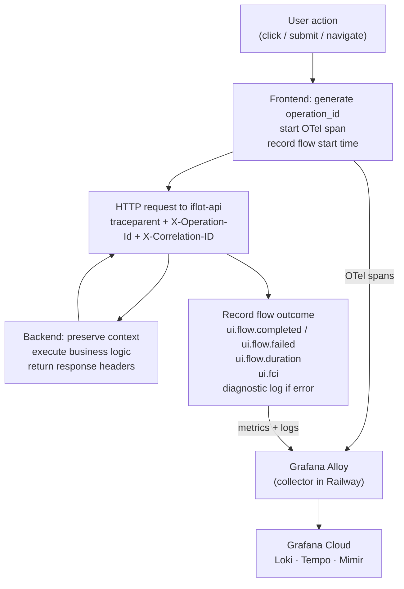
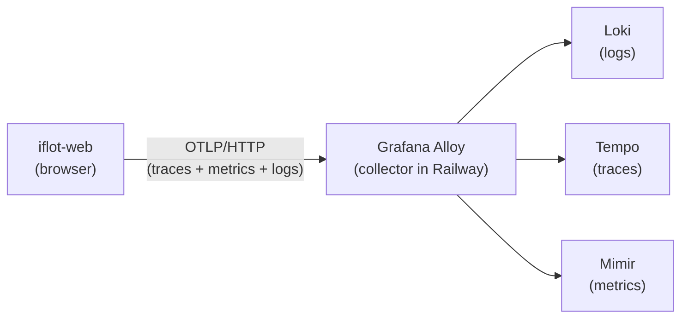

# ADR-008 — Frontend Observability Instrumentation

**Status:** Accepted
**Date:** 2026-04-19
**Deciders:** Frontend lead, Architecture team
**Tags:** observability, frontend, opentelemetry, metrics, context-propagation

---

## Why this decision matters

Backend observability alone is incomplete. A healthy backend does not mean
the user experience is healthy. Network latency, rendering bottlenecks, and
frontend errors are invisible to server-side telemetry.

SLOs in iFlot are authoritative from the frontend layer. If the frontend
does not instrument flows, SLOs cannot be computed.

---

## Context

iFlot frontend (`iflot-web`) is a React SPA. It initiates all user-facing
business flows and is the authoritative source for user-perceived latency.

The frontend must:

- generate `operation_id` for every user-initiated flow
- propagate correlation context to the backend via HTTP headers
- emit flow-level metrics for SLO measurement
- capture user-perceived latency independently of backend execution time
- connect frontend traces to backend traces through W3C Trace Context

Three signals are required:

| Signal | Purpose |
|---|---|
| Traces | Connect frontend execution to backend spans. Enable end-to-end diagnosis. |
| Metrics | Measure flow availability and latency from the user's perspective. Feed SLOs. |
| Logs | Capture flow boundaries and errors with correlation context. Diagnostic only. |

### Flows in scope

The following flows must be instrumented at launch:

| `flow_name` | Trigger |
|---|---|
| `login` | User submits credentials |
| `create_trip` | User submits trip creation form |
| `close_trip` | User confirms trip operational close |
| `close_guide` | User closes a cargo guide |
| `generate_preinvoice` | User triggers pre-invoice generation |

`flow_name` values are shared with the backend. Frontend and backend must
use identical values for the same business flow.

---

## Decision

**Use the OpenTelemetry browser SDK for traces and context propagation.
Use custom metric instrumentation via OTLP for flow-level and UX metrics.
Use structured frontend logs with correlation context for flow boundaries
and errors (diagnostic signal only).**

All telemetry flows through Grafana Alloy — the frontend does not send
directly to Grafana Cloud.

---

## How it works



---

## Tracing

### SDK

Use `@opentelemetry/sdk-trace-web` with automatic instrumentation for
`XMLHttpRequest` and `fetch`.

This enables:

- automatic HTTP client spans
- propagation of `traceparent`
- seamless connection with backend traces

### Context propagation

For every business flow:

1. Frontend starts or continues an OTel span at the flow entry point.
2. The SDK injects `traceparent` automatically on outbound requests.
3. Backend continues the trace.
4. Frontend and backend share the same `trace_id`.

`X-Operation-Id` is added manually. It is a business-level correlation ID
and is independent from `trace_id`.

### Manual spans

Manual spans must be used sparingly.

Allowed:

- one span per critical business flow, covering its full lifecycle
- orchestration steps in multi-step flows (not HTTP calls themselves)

Not allowed:

- component renders
- UI state transitions without business meaning
- duplication of automatically instrumented HTTP spans

### Sampling

The OTel SDK sampler must be configured explicitly. The default is 100%
sampling — at production traffic volumes this produces excessive trace
volume and cost.

Recommended starting configuration: `ParentBased(TraceIdRatioBased(0.1))`
— 10% of root spans sampled, child spans follow the parent decision.

Sampling ratio must be validated against actual Grafana Cloud volume after
the first 30 days of production traffic. Final sampling configuration and
collector-side rules are defined in ADR-006.

Application code must not implement custom sampling logic beyond the SDK
sampler configuration.

---

## Metrics

### Flow metrics

```text
ui.flow.started{flow_name, route}
ui.flow.completed{flow_name, route}
ui.flow.failed{flow_name, route}
ui.flow.duration{flow_name, route, result}
```

`result` values: `success` | `error`

These metrics are the authoritative SLO source.

### Route normalization

`route` must always be the normalized route template.

Good: `/trips/:id`
Bad: `/trips/1234`

Raw browser paths must never be used as metric tags.

### FCI — First Contentful Interaction

`ui.fci` is an iFlot-defined UX metric, not a standard Web Vital.

It measures time from user action to interactive UI state.

```text
ui.fci{flow_name, route}
```

- Start: user action
- End: UI becomes usable (not API response)

FCI targets are indicators, not SLO commitments.

### Web Vitals

Collected via `web-vitals` library:

```text
web_vitals.lcp
web_vitals.cls
web_vitals.inp
```

Note: INP is Chromium-only. Expect partial data across browsers.

### API interaction metrics

```text
ui.api.duration{http.route, method, status}
ui.api.errors{http.route, method, status}
```

`http.route` must always be a route template.

### High-cardinality rules

Never use as metric tags:

- `operation_id`
- `trace_id`
- `user_id`
- `trip_id`
- `guide_id`

---

## Logging

Frontend logs are a diagnostic signal only.

### Required fields

```json
{
  "timestamp": "...",
  "level": "INFO",
  "message": "Trip creation completed",
  "service.name": "iflot-web",
  "service.version": "1.0.0",
  "trace_id": "...",
  "operation_id": "...",
  "flow_name": "create_trip"
}
```

### When to log

- flow start
- flow success
- flow failure
- unhandled runtime errors

Not allowed:

- component lifecycle logs
- API logs (covered by metrics and traces)
- user input or sensitive data

### Export strategy

- Logs may be exported selectively.
- Logs must not be treated as a primary telemetry signal.
- Volume must be controlled to avoid excessive cost and noise.

---

## Retry rule

Mandatory rule:

**Same `operation_id`:**

- retry of the same business operation
- automatic retry on transient failure
- user resubmits without changing intent

**New `operation_id`:**

- new user intent
- user modifies data after failure
- user restarts the flow

Frontend owns this decision. The backend only preserves what it receives.

---

## Telemetry export



CORS must be configured on the Alloy endpoint to accept requests from the
frontend origin.

---

## Error capture

Frontend must capture:

- unhandled runtime errors
- unhandled promise rejections

These must include correlation context (`operation_id`, `trace_id`,
`flow_name`) and be emitted as diagnostic log events.

---

## Alternatives considered

### Manual instrumentation only — rejected

Inconsistent and high maintenance. Does not connect to backend traces via
`traceparent`. Span quality degrades as the number of flows grows.

### Datadog Browser SDK — rejected

Vendor lock-in at the instrumentation layer. OTel is vendor-neutral and
consistent with the backend instrumentation model. Data can be routed to
any backend; Datadog SDK data cannot.

### No frontend metrics — rejected

SLOs would be measured only from the backend. User-perceived latency
includes network and rendering time invisible to the server. A backend-only
SLO measures the wrong thing by definition.

---

## Consequences

### What gets better

- SLOs become measurable from the user perspective.
- Full trace from browser to backend via shared `trace_id`.
- Stable business correlation across retries via `operation_id`.

### Trade-offs accepted

- CORS configuration required on the Alloy endpoint.
- Partial Web Vitals coverage — INP is Chromium-only.
- Trace volume must be controlled via SDK sampler and Alloy rules from day one.

---

## What this ADR does not cover

- Alloy collector configuration and sampling rules — ADR-006
- Backend `FlowTracker` instrumentation — ADR-009
- Backend error handling and `ProblemDetail` model — ADR-010

---

## References

- [OpenTelemetry Browser SDK](https://opentelemetry.io/docs/languages/js/getting-started/browser/)
- [web-vitals library](https://github.com/GoogleChrome/web-vitals)
- `docs/observability/context-propagation-standard.md` — sections 6.2, 11, 14
- `docs/observability/metric-catalog.md` — sections 12, 13, 15
- `docs/observability/flow-slo-catalog.md` — sections 3, 8, 9
- `docs/observability/log-schema.md` — section 8